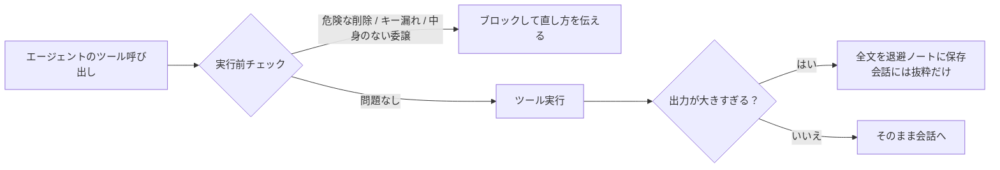

# context-kit

<div align="center">

[🇺🇸 English](README.md) ｜ **🇯🇵 日本語** ｜ [🇨🇳 简体中文](README.zh.md) ｜ [🇹🇭 ไทย](README.th.md)


[](LICENSE)


AI エージェントに本物の仕事を任せると、小さな事故がついてきます。巨大なログが作業記憶（会話に持てるコンテキスト）を押し流し、<br>
危ない削除コマンドまであと1歩、API キーがファイルに書き込まれる寸前——。<br>
context-kit は、その事故をツール実行のその場所で機械的に止める、5点セットの装備です。

**エージェントの作業机に、5つの装備を。**

🔧 [エンジニア向けドキュメント](docs/engineering.ja.md) ｜ 📘 [詳細仕様](docs/reference.ja.md)

</div>

## 目次

- [こんな経験はありませんか？](#pain)
- [できること](#what)
- [使うのに必要なもの](#requirements)
- [使いはじめる](#install)
- [安心して使える理由](#safety)
- [もっと詳しく](#docs)
- [ライセンス](#license)

---

<a id="pain"></a>

## こんな経験はありませんか？

AI エージェントに自分のマシンで仕事をさせている人なら、たぶん一度は経験しています:

- ビルドや検索のコマンド1発で数千行のログが出て、それまでの文脈がエージェントの記憶から押し出された
- サブエージェントに一言だけの「直しといて」を渡したら、まったく別物が返ってきた
- エージェントが危険な削除コマンドを打つ寸前だった、リポジトリをうっかり公開で作る寸前だった
- API キーがコマンドラインやコミットするファイルに入り込む寸前だった

context-kit は、この4つの事故をちょうど防ぐ、エージェント1体分の装備セットです。「気をつけてね」とお願いするのではなく、仕組みで止めます。

---

<a id="what"></a>

## できること

5つの装備は、エージェントの仕事の要所——ツールが動く直前と、出力が出た直後——に立ちます。



- 📦 **lg**

  うるさいシェルコマンドをエージェントの代わりに実行して、先頭と末尾だけを返します。ログの全文は手元の退避ノートに保存され、あとから読み返せます。

- 🧹 **scratch-persist**

  ラップし損ねた出力の安全網。大きすぎるツール出力を自動で退避ノートに複製するので、エージェントはコマンドを打ち直す代わりにディスクから読み直せます。

- 📋 **brief-validator**

  サブエージェントへの長い委譲を、3層のブリーフ——何を作るか・作った本人がどう自己チェックするか・レビュー担当が何で判定するか——がない限りブロックします。

- 🛡️ **safety-hooks**

  危険な削除、うっかり公開のリポジトリ作成、コマンドやファイルへの API キー混入。この3つをツールが実行される前に止める3本のガードです。

- 🔍 **recall**

  最大3層の記憶——ホスト型メモリサービス・ローカル検索インデックス・ただのファイル——を同時に検索して、過去の作業を出どころ（ファイルパスやメモリ ID）つきで呼び戻します。

どの装備も単独で動きます。1つだけ入れる、残りは無視する、あとから足す、すべてありです。

導入の前に、動く環境を確認しておきましょう。

---

<a id="requirements"></a>

## 使うのに必要なもの

| 項目 | 対応 |
| --- | --- |
| macOS | ✅ 検証済み |
| Linux | ⚠️ 動く想定（POSIX シェル + Python 標準ライブラリのみ）だが未検証 |
| AI エージェント | Claude Code ✅ — hook はその hook 仕様が対象 |
| Python | 3.9 以上（ほとんどの装備で必要） |
| Node.js | 18 以上（安全ガード3本のうち2本だけで必要） |

hook の仕組みを持たないエージェントで使う場合は、`lg` と `recall` の2つだけが対象です——この2つはどこでも動くただのコマンドラインツールです。残り3つは Claude Code の hook です。

環境が合っていれば、セットアップは数分で終わります。

---

<a id="install"></a>

## 使いはじめる

配線は Claude Code に一度だけ。以後は毎セッションの裏側で勝手に働きます。

### AI に入れてもらう

最短の道: これをエージェントに貼って、提案内容を確認するだけです。

```text
Clone https://github.com/caty-ai/context-kit.git and follow the
"Install it yourself" steps in its README: merge the kit's hooks into my
~/.claude/settings.json (merge — do not overwrite my existing settings),
then tell me what you wired and how I can verify it.
```

### 自分で入れる

1. キットを手元に持ってきます。

```sh
git clone https://github.com/caty-ai/context-kit.git
cd context-kit
```

2. あなたの checkout パスを埋め込んだ hook 配線を表示します。

```sh
sed "s|<CONTEXT_KIT_DIR>|$PWD|g" examples/settings.json
```

表示された出力から、使いたい `hooks` のエントリを `~/.claude/settings.json`（またはプロジェクトの `.claude/settings.json`）に写します。既存の設定は消さずにマージしてください。そのあと Claude Code を再起動するか `/hooks` を実行すると配線が反映されます。

3. 任意: 2つの CLI（`lg`・`recall`）を使うなら、キットの `bin` ディレクトリを `PATH` に足します。

```sh
export PATH="$PWD/bin:$PATH"
```

4. 動作確認。キットの自己チェックは一時ディレクトリだけを使います。

```sh
for t in tests/*.sh; do bash "$t"; done
```

全テストケースが `PASS` 行を出せば成功です。出力のどこにも `FAIL` がないことを確認してください（2つのスイートは末尾に失敗ゼロのサマリ行も出ます）。

<details>
<summary>うまくいかないとき</summary>

- `python3: command not found` — macOS なら `xcode-select --install` で Command Line Tools を入れます。Linux ならパッケージマネージャで Python 3.9+ を入れます。
- Node.js がない — Node 前提のガード2本は静かに無効のままです（配線が `node` の有無を先に確認します）。使いたくなったら Node 18+ を入れれば動きます。ほかの装備は Node なしで動きます。
- `settings.json` って何？ — Claude Code の設定ファイルです。その `hooks` セクションは「各ツール呼び出しの直前・直後に小さなチェックプログラムを走らせて」という指示です。キットはそこにエントリを足すだけで、消せば元の挙動に戻ります。
- `<CONTEXT_KIT_DIR>` を置き換え忘れた？ — 無害です。配線された各コマンドは最初にファイルの存在を確認して、なければ黙って何もしません。

</details>

エージェントに何かをフックさせるのはためらう——その答えが次のセクションです。

---

<a id="safety"></a>

## 安心して使える理由

このキットは「自分もいつか壊れる。そのとき絶対にエージェントを道連れにしない」前提で作られています。

- **fail-open 設計** — ファイルがない・インタプリタがない・内部エラー、のとき hook は黙ってツール呼び出しを素通しします。ブロックするのは本物の検知だけです。
- **既定は全ローカル動作** — ネットワークは使いません。唯一の例外は `recall` のオプトイン記憶レイヤーで、API キーを自分で設定した人だけ有効になります。退避ノートは所有者だけが読める権限で作られます。
- **装備は独立** — 各装備は独立した設定ブロックと独立したファイルです。共有デーモンも装備間の共有状態もありません。
- **消すのは1操作** — `settings.json` からキットのブロックを消して再起動するだけ。退避ノートはただのファイルで、1行の掃除コマンドがドキュメントにあります。

正直な限界をひとつ: ガードはパターン照合式の仕掛け線です。この4つの事故の「よくある形」を捕まえるもので、あらゆる変種を捕まえるものではありません——既知の取りこぼしはドキュメントに公開で列挙してあります。

詳細は、読者別のドキュメントに1段深く分けてあります。

---

<a id="docs"></a>

## もっと詳しく

| 読みたいこと | 場所 |
| --- | --- |
| アーキテクチャ・設計原則・エンジニア向けクイックスタート | [エンジニアリングガイド](docs/engineering.ja.md)（[English](docs/engineering.md)） |
| 全環境変数・ファイル契約・終了コードの規則 | [詳細仕様](docs/reference.ja.md)（[English](docs/reference.md)） |
| 装備を1つずつ、導入と検証の手順つきで | [lg](docs/lg.md) ・ [scratch-persist](docs/scratch-persist.md) ・ [brief-validator](docs/brief-validator.md) ・ [safety-hooks](docs/safety-hooks.md) ・ [recall](docs/recall.md) |

---

<a id="license"></a>

## ライセンス

[MIT](LICENSE) です。このキットは「気に入った装備を自分の環境に自由に写して使ってほしい」ために存在します。ゆるい許諾は脚注ではなく目的そのものです。

<div align="center">

**素の hooks + 小さな CLI** ｜ **fail-open 設計** ｜ **MIT**

</div>
