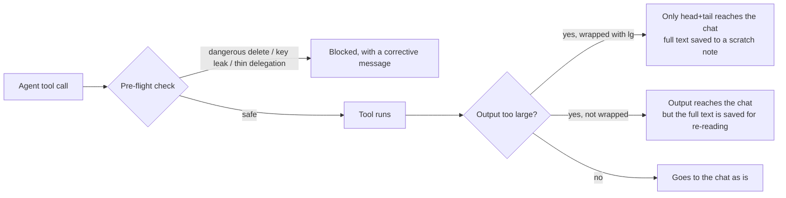

# context-kit

<div align="center">

**🇺🇸 English** ｜ [🇯🇵 日本語](README.ja.md) ｜ [🇨🇳 简体中文](README.zh.md) ｜ [🇹🇭 ไทย](README.th.md)


[](LICENSE)
[](https://www.npmjs.com/package/@caty-ai/context-kit)


[](https://github.com/caty-ai/context-kit/actions/workflows/test-lint.yml)

Hand real work to an AI agent and small accidents follow: one giant log floods its working memory,<br>
a risky delete is one keystroke away, an API key almost lands in a file.<br>
context-kit is a six-piece equipment set that stops these accidents mechanically, right where tools run.

**Six pieces of equipment for your agent's desk.**

🔧 [Engineering guide](docs/engineering.md) ｜ 📘 [Reference](docs/reference.md)

</div>

## Contents

- [Sound familiar?](#pain)
- [What it does](#what)
- [What you need](#requirements)
- [Get started](#install)
- [Why it's safe to adopt](#safety)
- [Learn more](#docs)
- [Project status](#status)
- [License](#license)

---

<a id="pain"></a>

## Sound familiar?

If you let an AI agent do real work on your machine, you have probably met at least one of these:

- One build or search command prints thousands of lines, and older context gets pushed out of the agent's memory
- A subagent receives a one-line "please fix it" and comes back with something unrelated
- The agent almost runs a destructive delete, or almost creates a repository as public
- An API key nearly ends up inside a command line or a committed file

context-kit is a six-piece equipment set for a single agent that prevents exactly these four accidents — by mechanism, not by asking the agent to be careful.

---

<a id="what"></a>

## What it does

Five of the six pieces stand at the choke points of agent work: right before a tool runs, and right after it produces output. The sixth captures a disposable worktree before you remove it.



- 📦 **lg**

  Runs a noisy shell command on the agent's behalf and returns only the head and tail. The full log is saved to a local scratch note the agent can read back later.

- 🧹 **scratch-persist**

  The safety net for output nobody wrapped: any oversized tool output is automatically copied to a scratch note, so the agent can re-read it from disk instead of re-running the command.

- 📋 **brief-validator**

  Blocks a long delegation to a subagent unless it carries a three-part brief: what to build, how the worker self-checks, and how a reviewer judges it. The default section headings are the Japanese ones from the public handbook this contract comes from — swappable with one environment variable.

- 🛡️ **safety-hooks**

  Three guards that stop dangerous deletes, accidentally-public repositories, and provider API keys in commands or file content — before the tool executes.

- 🔍 **recall**

  Searches up to three memory layers at once (a hosted memory service, a local search index, plain files) and returns past work with the file path or memory ID it came from.

- 📸 **wt-snapshot**

  Captures a worktree's HEAD plus tracked, untracked, and configured ignored state into a durable ref in the main repository before a human deletes the worktree. It can later restore that exact state into a fresh directory.

Every piece works on its own. Adopt one, ignore the rest, add more later.

Before installing, check what it runs on.

---

<a id="requirements"></a>

## What you need

| Item | Support |
| --- | --- |
| macOS | ✅ tested, including `wt-snapshot` with the system bsdtar |
| Linux | ✅ verified in CI (ubuntu-latest); `wt-snapshot` capability-probes local tar options and reports unsupported metadata suppression |
| AI agent | Claude Code ✅ — the hooks target its hook spec |
| Python | 3.9 or newer, required by most pieces |
| Node.js | 18 or newer, only for two of the three safety guards |

If your agent tool has no hook mechanism, `lg`, `recall`, and `wt-snapshot` still apply — they are plain command-line tools that work anywhere. The other three pieces are Claude Code hooks.

If that matches your machine, setup takes a few minutes.

---

<a id="install"></a>

## Get started

You wire the kit into Claude Code once; from then on it works in the background of every session.

### Install from npm

Run the guided installer. It starts with a dry-run and prints the exact `--apply` command after you review the file plan and settings diff.

```sh
npx @caty-ai/context-kit install
```

Or install it globally. This adds `lg`, `recall`, `wt-snapshot`, and the `context-kit` installer to your `PATH`.

```sh
npm i -g @caty-ai/context-kit
context-kit install
```

Uninstall notes live in the [npm README](https://github.com/caty-ai/context-kit/blob/main/packages/npm/README.md#uninstall).

The clone-based steps below remain available as the manual alternative.

### Ask your AI to install it

The shortest path: paste this to your agent and review what it proposes.

```text
Clone https://github.com/caty-ai/context-kit.git and follow the
"Install it yourself" steps in its README: merge the kit's hooks into my
~/.claude/settings.json (merge — do not overwrite my existing settings),
then tell me what you wired and how I can verify it.
```

### Install it yourself

1. Get the kit onto your machine.

```sh
git clone https://github.com/caty-ai/context-kit.git
cd context-kit
```

2. Print the hook wiring with your checkout path filled in.

```sh
sed "s|<CONTEXT_KIT_DIR>|$PWD|g" examples/settings.json
```

Copy the `hooks` entries you want from that output into `~/.claude/settings.json` (or a project's `.claude/settings.json`). Merge them into the file — do not overwrite unrelated settings. Then restart Claude Code or run `/hooks` so the wiring is picked up.

3. Optional: make the three CLIs (`lg`, `recall`, `wt-snapshot`) available by adding the kit's `bin` directory to your `PATH`.

```sh
export PATH="$PWD/bin:$PATH"
```

4. Verify. The kit's self-checks run only against temporary directories.

```sh
make test
```

Every test case prints a `PASS` line — there should be no `FAIL` anywhere in the output (two suites also end with a zero-failure summary line).

<details>
<summary>If something goes wrong</summary>

- `python3: command not found` — on macOS, install the Command Line Tools with `xcode-select --install`. On Linux, install Python 3.9+ from your package manager.
- No Node.js — the two Node-based guards stay silently inactive (the wiring checks for `node` before running them). Install Node 18+ when you want them; everything else works without it.
- What is `settings.json`? — Claude Code's configuration file. Its `hooks` section tells Claude Code to run small check programs right before or after each tool call. The kit only adds entries there; deleting them restores the previous behavior.
- Left `<CONTEXT_KIT_DIR>` unreplaced? — harmless. Each wired command first checks that the file exists and silently does nothing otherwise.

</details>

Hesitant to let anything hook into your agent? The next section is the answer.

---

<a id="safety"></a>

## Why it's safe to adopt

The kit is built on the assumption that it will sometimes break — and that breaking must never take your agent down.

- **Fail-open by design** — a missing file, a missing interpreter, or an internal error makes a hook stay silent and let the tool call through. A blocking exit is reserved for a genuine detection.
- **Local by default** — no network calls, except the one opt-in memory layer of `recall` that only activates when you configure its API key. Scratch notes live in a directory created with owner-only permissions — but they hold whatever the tool printed, secrets included, and a directory you point elsewhere yourself keeps its own permissions. Treat them accordingly.
- **Independent pieces** — each piece is its own settings block and its own file. There is no shared daemon and no shared state between them.
- **One edit to remove** — delete the kit's blocks from `settings.json` and restart. Scratch notes are plain files with a documented one-line cleanup command.

One honest limit: the guards are pattern-based tripwires. They catch the common shapes of these accidents, not every possible variant — and the known gaps are listed openly in the documentation.

The details live in reader-specific docs, one level deeper.

---

<a id="docs"></a>

## Learn more

| If you want | Read |
| --- | --- |
| The architecture, design principles, and an engineer's quick start | [Engineering guide](docs/engineering.md)（[🇯🇵 日本語](docs/engineering.ja.md)） |
| Every environment variable, file contract, and exit-code rule | [Reference](docs/reference.md)（[🇯🇵 日本語](docs/reference.ja.md)） |
| Worktree snapshots before deletion, restore, ignored-path capture, and prune listing | [wt-snapshot](docs/wt-snapshot.md)（[🇯🇵 日本語](docs/wt-snapshot.ja.md)） |
| One piece at a time, with install and verify steps | [lg](docs/lg.md) ・ [scratch-persist](docs/scratch-persist.md) ・ [brief-validator](docs/brief-validator.md) ・ [safety-hooks](docs/safety-hooks.md) ・ [recall](docs/recall.md) ・ [wt-snapshot](docs/wt-snapshot.md) |

---

<a id="status"></a>

## Project status

- **CI:** Live. gitleaks, history-check, test + lint (ubuntu & macOS), pr-size, and the risk-review gate run on every PR as callers of the family reusable workflows (pinned `ci-v1`); the badge above is painted by the test-lint workflow.
- **Verified environments:** macOS (local + CI runner) | Linux (CI runner, ubuntu-latest).
- **Maturity:** v0.2.0 shipped the sixth piece, `wt-snapshot`. Interfaces may still move.
- **Known limits:** Safety guards are fail-open by design: a broken guard never blocks the agent. The project is macOS-first; the Linux/GNU tar path of `wt-snapshot` is exercised by CI.

<!-- family:generated:family-footer:start -->

---

Part of the **Caty AI family** — open tools for running a family of AI agents. The full map, including modules still being prepared for release, lives in [Family OS](https://github.com/caty-ai/family-os).

| Axis | Module | What it does | State |
| --- | --- | --- | --- |
| Map | [Family OS](https://github.com/caty-ai/family-os) | The map of the whole family — every module, its state, and how they fit | published, MIT |
| Rules | [Family Dev Handbook](https://github.com/caty-ai/family-dev-handbook) | The rules of the road — issues, PRs, worktrees, handoffs, parallel development | published, MIT |
| Vertical · foundation | [Caty Agent Harness](https://github.com/caty-ai/caty-agent-harness) | Task backbone for AI agents — retries, checkpoints, and honest completion | published, MIT |
| Vertical | **context-kit** | Six-piece context hygiene kit for one agent — bounded output, delegation briefs, safety guards, recall, worktree snapshots | published, MIT |
| Vertical | [Persona Engine](https://github.com/caty-ai/persona-engine) | Gives an agent a persona — layered personality and graded emotion | published, MIT |
| Vertical | [Persona Growth Loop](https://github.com/caty-ai/persona-growth-loop) | Grows the persona itself — minimal, idempotent proposals | published, MIT |
| Vertical | [X Collector](https://github.com/caty-ai/x-collector) | Turns X and the web into one daily digest — for people and agents | published, MIT |
| Vertical | [Self Growth Loop](https://github.com/caty-ai/self-growth-loop) | Lets an agent grow its own abilities — proposals, governance, adoption records | published, MIT |
| Horizontal · foundation | [Family Memory Architecture](https://github.com/caty-ai/family-memory-architecture) | The memory bus — how the family shares what it knows | published, MIT |
| Horizontal | [Sitter](https://github.com/caty-ai/sitter) | Babysits delegated agent runs — watches, keeps evidence, restarts only within declared bounds | published, MIT |
| Horizontal | [Alpha Nightshift](https://github.com/caty-ai/alpha-nightshift) | Nightly autonomous maintenance loop — isolated night lanes behind a deny-by-default guard; humans cherry-pick in the morning | published, MIT |

<!-- family:generated:family-footer:end -->

---

<a id="license"></a>

## License

[MIT](LICENSE). The kit exists so you can copy pieces into your own setup freely — a permissive license is the point, not a footnote.

<div align="center">

**Plain hooks + small CLIs** ｜ **Fail-open by design** ｜ **MIT**

</div>
