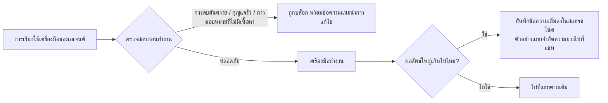

# context-kit

<div align="center">

[🇺🇸 English](README.md) ｜ [🇯🇵 日本語](README.ja.md) ｜ [🇨🇳 简体中文](README.zh.md) ｜ **🇹🇭 ไทย**


[](LICENSE)


มอบงานจริงให้ AI เอเจนต์ทำ แล้วอุบัติเหตุเล็กๆ ก็จะตามมา ล็อกไฟล์มหึมาไฟล์เดียวท่วมความจำการทำงานของมัน<br>
คำสั่งลบไฟล์อันตรายอยู่ห่างแค่ปุ่มเดียว กุญแจ API เกือบหลุดเข้าไปในไฟล์<br>
context-kit คือชุดอุปกรณ์ 5 ชิ้นที่หยุดอุบัติเหตุเหล่านี้ด้วยกลไก ตรงจุดที่เครื่องมือทำงานพอดี

**อุปกรณ์ 5 ชิ้นสำหรับโต๊ะทำงานของเอเจนต์คุณ**

🔧 [คู่มือวิศวกร](docs/engineering.md) ｜ 📘 [เอกสารอ้างอิง](docs/reference.md)

</div>

## สารบัญ

- [คุ้นๆ ไหม?](#pain)
- [มันทำอะไรได้บ้าง](#what)
- [สิ่งที่คุณต้องมี](#requirements)
- [เริ่มต้นใช้งาน](#install)
- [ทำไมถึงปลอดภัยที่จะใช้](#safety)
- [อ่านเพิ่มเติม](#docs)
- [สัญญาอนุญาต](#license)

---

<a id="pain"></a>

## คุ้นๆ ไหม?

ถ้าคุณปล่อยให้ AI เอเจนต์ทำงานจริงบนเครื่องของคุณ คุณคงเคยเจออย่างน้อยหนึ่งในนี้มาแล้ว:

- คำสั่งบิลด์หรือค้นหาคำสั่งเดียวพ่นออกมาเป็นพันบรรทัด แล้วบริบทเก่าก็ถูกดันออกจากความจำของเอเจนต์
- ซับเอเจนต์ได้รับคำสั่งสั้นๆ แค่บรรทัดเดียวว่า "ช่วยแก้ให้หน่อย" แล้วก็ส่งอะไรที่ไม่เกี่ยวข้องกลับมา
- เอเจนต์เกือบรันคำสั่งลบที่ทำลายข้อมูล หรือเกือบสร้างรีโพซิทอรีเป็นสาธารณะ
- กุญแจ API เกือบไปจบอยู่ในบรรทัดคำสั่งหรือไฟล์ที่ถูกคอมมิต

context-kit คือชุดอุปกรณ์ 5 ชิ้นสำหรับเอเจนต์หนึ่งตัว ที่ป้องกันอุบัติเหตุทั้ง 4 แบบนี้ได้พอดี — ด้วยกลไก ไม่ใช่การขอร้องให้เอเจนต์ระมัดระวัง

---

<a id="what"></a>

## มันทำอะไรได้บ้าง

อุปกรณ์ทั้ง 5 ชิ้นยืนอยู่ตรงจุดคอขวดของงานเอเจนต์ นั่นคือ ก่อนเครื่องมือจะทำงาน และหลังจากที่มันสร้างผลลัพธ์ออกมา



- 📦 **lg**

  รันคำสั่งเชลล์ที่มีเอาต์พุตเยอะแทนเอเจนต์ แล้วส่งกลับมาแค่ส่วนต้นกับส่วนท้าย ล็อกฉบับเต็มถูกบันทึกไว้ในสแครชโน้ตในเครื่อง ที่เอเจนต์อ่านย้อนกลับไปดูได้ทีหลัง

- 🧹 **scratch-persist**

  ตาข่ายนิรภัยสำหรับผลลัพธ์ที่ไม่มีใครห่อไว้ ผลลัพธ์ของเครื่องมือที่ใหญ่เกินไปจะถูกคัดลอกไปยังสแครชโน้ตโดยอัตโนมัติ เอเจนต์จึงอ่านย้อนกลับจากดิสก์ได้แทนที่จะต้องรันคำสั่งซ้ำ

- 📋 **brief-validator**

  บล็อกการมอบหมายงานยาวๆ ให้ซับเอเจนต์ เว้นแต่จะมีบรีฟ 3 ส่วนแนบมาด้วย คือ จะสร้างอะไร ผู้ทำงานเช็คตัวเองอย่างไร และผู้รีวิวตัดสินอย่างไร

- 🛡️ **safety-hooks**

  การ์ด 3 ตัวที่หยุดการลบอันตราย รีโพซิทอรีที่เผลอตั้งเป็นสาธารณะ และกุญแจ API ของผู้ให้บริการที่หลุดเข้าไปในคำสั่งหรือเนื้อหาไฟล์ — ก่อนที่เครื่องมือจะทำงาน

- 🔍 **recall**

  ค้นหาความจำได้พร้อมกันสูงสุด 3 ชั้น (บริการความจำแบบโฮสต์, ดัชนีค้นหาในเครื่อง, ไฟล์ธรรมดา) แล้วส่งงานเก่ากลับมาพร้อมที่มา ไม่ว่าจะเป็นพาธไฟล์หรือ memory ID

แต่ละชิ้นทำงานได้ด้วยตัวเองอย่างอิสระ จะเลือกใช้แค่ชิ้นเดียว ไม่สนใจที่เหลือ หรือค่อยเพิ่มทีหลังก็ได้ทั้งนั้น

ก่อนติดตั้ง มาดูกันก่อนว่ามันทำงานบนอะไรได้บ้าง

---

<a id="requirements"></a>

## สิ่งที่คุณต้องมี

| รายการ | การรองรับ |
| --- | --- |
| macOS | ✅ ทดสอบแล้ว |
| Linux | ⚠️ คาดว่าใช้ได้ (POSIX shell + Python standard library) แต่ยังไม่ได้ตรวจสอบ |
| AI เอเจนต์ | Claude Code ✅ — hook ออกแบบมาตาม hook spec ของมันโดยเฉพาะ |
| Python | 3.9 ขึ้นไป จำเป็นสำหรับอุปกรณ์ส่วนใหญ่ |
| Node.js | 18 ขึ้นไป ใช้เฉพาะการ์ดความปลอดภัย 2 ใน 3 ตัว |

ถ้าเครื่องมือเอเจนต์ของคุณไม่มีกลไก hook จะใช้ได้แค่ `lg` กับ `recall` เท่านั้น — ทั้งสองตัวนี้เป็นเครื่องมือบรรทัดคำสั่งธรรมดาที่ใช้ได้ทุกที่ ส่วนอีก 3 ชิ้นเป็น hook ของ Claude Code

ถ้าเครื่องของคุณตรงตามนี้ การติดตั้งใช้เวลาแค่ไม่กี่นาที

---

<a id="install"></a>

## เริ่มต้นใช้งาน

คุณเชื่อมต่อคิทนี้เข้ากับ Claude Code แค่ครั้งเดียว จากนั้นมันจะทำงานอยู่เบื้องหลังทุกเซสชันให้เอง

### ให้ AI ติดตั้งให้

ทางลัดที่สุด: วางข้อความนี้ให้เอเจนต์ของคุณ แล้วตรวจดูสิ่งที่มันเสนอ

```text
Clone https://github.com/caty-ai/context-kit.git and follow the
"Install it yourself" steps in its README: merge the kit's hooks into my
~/.claude/settings.json (merge — do not overwrite my existing settings),
then tell me what you wired and how I can verify it.
```

### ติดตั้งด้วยตัวเอง

1. ดึงคิทมาไว้ที่เครื่องของคุณ

```sh
git clone https://github.com/caty-ai/context-kit.git
cd context-kit
```

2. พิมพ์การเชื่อมต่อ hook โดยใส่พาธ checkout ของคุณเข้าไปให้เรียบร้อย

```sh
sed "s|<CONTEXT_KIT_DIR>|$PWD|g" examples/settings.json
```

คัดลอกรายการ `hooks` ที่คุณต้องการจากผลลัพธ์นั้นไปใส่ใน `~/.claude/settings.json` (หรือ `.claude/settings.json` ของโปรเจกต์) รวมเข้ากับไฟล์เดิม — อย่าเขียนทับการตั้งค่าอื่นที่ไม่เกี่ยวข้อง จากนั้นรีสตาร์ท Claude Code หรือรันคำสั่ง `/hooks` เพื่อให้การเชื่อมต่อมีผล

3. ไม่บังคับ: ทำให้ใช้ CLI ทั้ง 2 ตัว (`lg`, `recall`) ได้ โดยเพิ่มไดเรกทอรี `bin` ของคิทเข้าไปใน `PATH`

```sh
export PATH="$PWD/bin:$PATH"
```

4. ตรวจสอบการทำงาน การเช็คตัวเองของคิทจะรันกับไดเรกทอรีชั่วคราวเท่านั้น

```sh
for t in tests/*.sh; do bash "$t"; done
```

ทุกกรณีทดสอบจะพิมพ์บรรทัด `PASS` ออกมา — ในผลลัพธ์ทั้งหมดต้องไม่มี `FAIL` เลย (มี 2 ชุดทดสอบที่จบด้วยบรรทัดสรุปว่าไม่มีความล้มเหลวเพิ่มเติมด้วย)

<details>
<summary>ถ้ามีอะไรผิดพลาด</summary>

- `python3: command not found` — บน macOS ให้ติดตั้ง Command Line Tools ด้วย `xcode-select --install` บน Linux ให้ติดตั้ง Python 3.9+ ผ่านตัวจัดการแพ็กเกจของคุณ
- ไม่มี Node.js — การ์ดที่พึ่ง Node 2 ตัวจะไม่ทำงานแบบเงียบๆ (การเชื่อมต่อจะเช็คว่ามี `node` ก่อนรันเสมอ) ติดตั้ง Node 18+ เมื่อไหร่ก็ใช้งานได้ทันที ส่วนที่เหลือทำงานได้โดยไม่ต้องมี Node
- `settings.json` คืออะไร? — ไฟล์การตั้งค่าของ Claude Code ส่วน `hooks` ในไฟล์นี้บอกให้ Claude Code รันโปรแกรมตรวจสอบเล็กๆ ก่อนหรือหลังการเรียกใช้เครื่องมือแต่ละครั้ง คิทแค่เพิ่มรายการเข้าไปตรงนั้น การลบรายการออกก็จะคืนพฤติกรรมเดิม
- ลืมแทนที่ `<CONTEXT_KIT_DIR>`? — ไม่เป็นไร แต่ละคำสั่งที่เชื่อมต่อไว้จะเช็คก่อนว่าไฟล์มีอยู่จริงหรือไม่ ถ้าไม่มีก็จะไม่ทำอะไรแบบเงียบๆ

</details>

ยังลังเลที่จะให้อะไรมาเกาะกับเอเจนต์ของคุณอยู่ใช่ไหม? หัวข้อถัดไปคือคำตอบ

---

<a id="safety"></a>

## ทำไมถึงปลอดภัยที่จะใช้

คิทนี้ถูกสร้างขึ้นบนสมมติฐานว่ามันจะพังบ้างในบางครั้ง — และการพังนั้นต้องไม่มีวันดึงเอเจนต์ของคุณล้มไปด้วย

- **ออกแบบให้ fail-open** — ไฟล์หาย ไม่มีอินเทอร์พรีเตอร์ หรือเกิดข้อผิดพลาดภายใน จะทำให้ hook เงียบและปล่อยให้เครื่องมือทำงานต่อไป การบล็อกจะเกิดขึ้นก็ต่อเมื่อตรวจพบปัญหาจริงๆ เท่านั้น
- **ทำงานในเครื่องเป็นค่าเริ่มต้น** — ไม่มีการเรียกเครือข่ายเลย ยกเว้นชั้นความจำแบบ opt-in ของ `recall` ที่จะทำงานก็ต่อเมื่อคุณตั้งค่ากุญแจ API เอง สแครชโน้ตอยู่ในไดเรกทอรีที่สร้างด้วยสิทธิ์เฉพาะเจ้าของเท่านั้น
- **แต่ละชิ้นเป็นอิสระต่อกัน** — แต่ละอุปกรณ์มีบล็อกการตั้งค่าและไฟล์ของตัวเอง ไม่มี daemon ร่วมและไม่มีสถานะที่แชร์กันระหว่างชิ้น
- **ถอดออกด้วยการแก้ไขครั้งเดียว** — ลบบล็อกของคิทออกจาก `settings.json` แล้วรีสตาร์ท สแครชโน้ตเป็นไฟล์ธรรมดาที่มีคำสั่งล้างข้อมูลบรรทัดเดียวระบุไว้ในเอกสาร

ข้อจำกัดที่ต้องยอมรับตรงๆ: การ์ดเหล่านี้เป็นกับดักที่ทำงานตามรูปแบบ (pattern-based tripwires) มันจับรูปแบบทั่วไปของอุบัติเหตุเหล่านี้ได้ แต่ไม่ใช่ทุกกรณีที่เป็นไปได้ — และช่องโหว่ที่รู้อยู่แล้วก็ถูกระบุไว้อย่างเปิดเผยในเอกสาร

รายละเอียดเชิงลึกอยู่ในเอกสารที่แยกตามกลุ่มผู้อ่าน ลึกลงไปอีกหนึ่งชั้น

---

<a id="docs"></a>

## อ่านเพิ่มเติม

| ถ้าคุณต้องการ | อ่าน |
| --- | --- |
| สถาปัตยกรรม หลักการออกแบบ และคู่มือเริ่มต้นฉบับวิศวกร | [คู่มือวิศวกร](docs/engineering.md)（[日本語](docs/engineering.ja.md)） |
| ตัวแปรสภาพแวดล้อมทุกตัว ข้อตกลงไฟล์ และกฎ exit code ทั้งหมด | [เอกสารอ้างอิง](docs/reference.md)（[日本語](docs/reference.ja.md)） |
| ทีละชิ้น พร้อมขั้นตอนติดตั้งและตรวจสอบ | [lg](docs/lg.md) ・ [scratch-persist](docs/scratch-persist.md) ・ [brief-validator](docs/brief-validator.md) ・ [safety-hooks](docs/safety-hooks.md) ・ [recall](docs/recall.md) |

---

<a id="license"></a>

## สัญญาอนุญาต

[MIT](LICENSE) คิทนี้มีอยู่เพื่อให้คุณคัดลอกอุปกรณ์แต่ละชิ้นไปใช้ในระบบของคุณเองได้อย่างอิสระ — สัญญาอนุญาตแบบเปิดกว้างคือจุดประสงค์หลัก ไม่ใช่แค่เชิงอรรถ

<div align="center">

**hook ธรรมดา + CLI เล็กๆ** ｜ **ออกแบบแบบ fail-open** ｜ **MIT**

</div>
