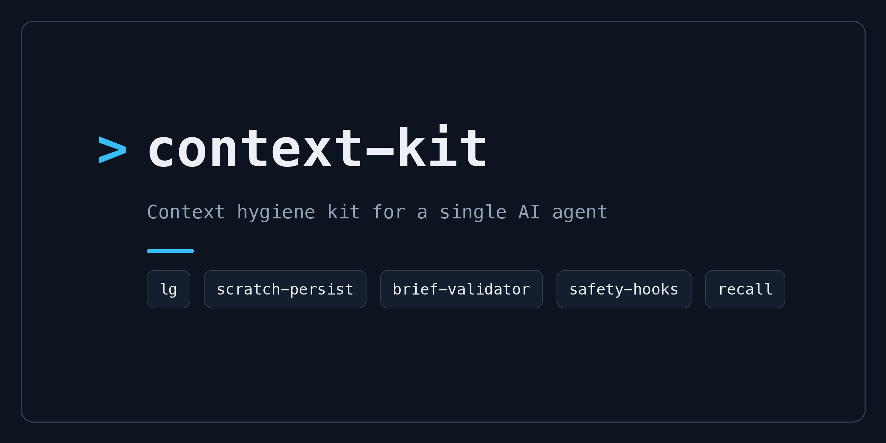
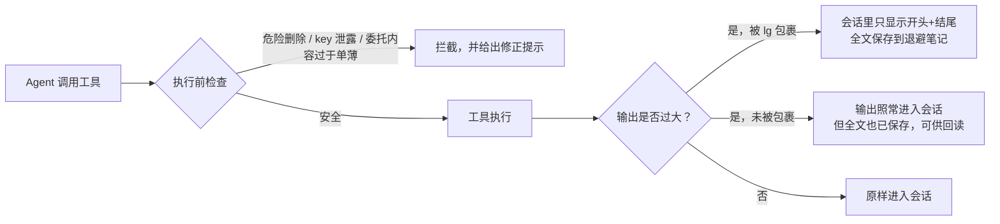

# context-kit

<div align="center">

[🇺🇸 English](README.md) ｜ [🇯🇵 日本語](README.ja.md) ｜ **🇨🇳 简体中文** ｜ [🇹🇭 ไทย](README.th.md)



[](LICENSE)


把真正的工作交给 AI agent 之后，各种小事故就会跟着来: 一条命令打印出成千上万行日志，把它工作记忆里的旧内容全部挤掉，<br>
一次危险的删除操作只差一步就要执行，一个 API key 差点被写进文件里。<br>
context-kit 是一套六件装备，专门在工具运行的那个瞬间，用机制把这些事故挡下来。

**为你的 agent 工作台配上 6 件装备。**

🔧 [工程指南](docs/engineering.md) ｜ 📘 [参考文档](docs/reference.md)

</div>

## 目录

- [是不是很眼熟？](#pain)
- [它能做什么](#what)
- [你需要准备什么](#requirements)
- [开始使用](#install)
- [为什么用起来放心](#safety)
- [了解更多](#docs)
- [许可协议](#license)

---

<a id="pain"></a>

## 是不是很眼熟？

如果你让 AI agent 在自己的电脑上做真实的工作，下面这些情况你多半遇到过至少一个:

- 一条构建或搜索命令打印出几千行输出，agent 记忆里更早的上下文被挤了出去
- 给子 agent 丢了一句"帮我修一下"，结果它交回来的东西完全对不上
- agent 差点执行了一次破坏性的删除，或者差点把仓库建成了公开的
- 一个 API key 差点被写进命令行或者提交进了文件里

context-kit 是为单个 agent 准备的六件装备，专门防住这四类事故——靠的是机制本身，而不是提醒 agent "小心点"。

---

<a id="what"></a>

## 它能做什么

六件装备里有五件守在 agent 工作的关键节点上: 工具执行前的那一刻，以及工具产生输出之后的那一刻。第六件则负责在你删除临时 worktree 之前先把它封存起来。



- 📦 **lg**

  代替 agent 执行会产生大量输出的 shell 命令，只返回开头和结尾。完整日志会保存到本地的退避笔记里，供之后回读。

- 🧹 **scratch-persist**

  为那些没有被特意包裹的输出兜底: 任何过大的工具输出都会被自动复制到退避笔记，agent 可以从磁盘上重新读取，而不必再跑一遍命令。

- 📋 **brief-validator**

  除非一次委托带齐三层说明——要做什么、执行者怎么自查、评审者依据什么判断——否则会拦下这次对子 agent 的长篇委托。默认的分节标题，用的是这份契约出处——那本公开 handbook——里的日语标题，可以用一个环境变量整体替换。

- 🛡️ **safety-hooks**

  三道防线，分别在工具执行前拦住危险删除、不小心把仓库建成公开、以及命令或文件内容中混入的服务商 API key。

- 🔍 **recall**

  同时搜索最多三层记忆（托管的记忆服务、本地搜索索引、纯文本文件），并连同来源（文件路径或记忆 ID）一起返回过去的工作记录。

- 📸 **wt-snapshot**

  在人手动删除 worktree 之前，把它的 HEAD、tracked 改动、untracked 文件，以及你指定要纳入的 ignored 内容一起封存到主仓库里的耐久 ref。之后可以把这份状态原样恢复到一个全新的目录。

每件装备都能独立工作。装一件、其余先不管、以后再慢慢加，都可以。

在安装之前，先确认一下运行环境。

---

<a id="requirements"></a>

## 你需要准备什么

| 项目 | 支持情况 |
| --- | --- |
| macOS | ✅ 已测试 |
| Linux | ⚠️ 预期可用（POSIX shell + Python 标准库），尚未验证 |
| AI agent | Claude Code ✅ — hook 是针对它的 hook 规范设计的 |
| Python | 3.9 及以上，大多数装备都需要 |
| Node.js | 18 及以上，三道安全防线中有两道需要 |

如果你的 agent 工具没有 hook 机制，`lg`、`recall` 和 `wt-snapshot` 也照样适用——它们是纯粹的命令行工具，在哪里都能跑。其余三件是 Claude Code 的 hook。

如果你的机器符合上面的条件，配置只需要几分钟。

---

<a id="install"></a>

## 开始使用

你只需要把这套装备接入 Claude Code 一次；之后它就会在每次会话的背后默默工作。

### 让 AI 帮你安装

最快的路径: 把下面这段贴给你的 agent，然后审核它提出的方案。

```text
Clone https://github.com/caty-ai/context-kit.git and follow the
"Install it yourself" steps in its README: merge the kit's hooks into my
~/.claude/settings.json (merge — do not overwrite my existing settings),
then tell me what you wired and how I can verify it.
```

### 自己动手安装

1. 把这套装备下载到本地。

```sh
git clone https://github.com/caty-ai/context-kit.git
cd context-kit
```

2. 打印出填好你本地路径的 hook 配置。

```sh
sed "s|<CONTEXT_KIT_DIR>|$PWD|g" examples/settings.json
```

从输出里挑出你想要的 `hooks` 条目，复制进 `~/.claude/settings.json`（或某个项目自己的 `.claude/settings.json`）。要合并进去，不要覆盖掉不相关的设置。然后重启 Claude Code，或者运行 `/hooks`，让配置生效。

3. 可选: 把这套装备的 `bin` 目录加进 `PATH`，就能直接使用三个 CLI 工具（`lg`、`recall`、`wt-snapshot`）。

```sh
export PATH="$PWD/bin:$PATH"
```

4. 验证一下。这套装备的自检只会在临时目录里运行。

```sh
for t in tests/*.sh; do bash "$t"; done
```

每个测试用例都会打印一行 `PASS`——输出里不应该出现任何 `FAIL`（其中两个套件末尾还会附一行零失败的汇总）。

<details>
<summary>如果出了问题</summary>

- `python3: command not found` — macOS 上运行 `xcode-select --install` 安装 Command Line Tools。Linux 上用你的包管理器安装 Python 3.9 及以上版本。
- 没有 Node.js — 两道基于 Node 的防线会安静地保持不激活状态（配置逻辑会先检查 `node` 是否存在再运行它们）。想用的话装上 Node 18+ 即可；其余部分都不依赖它。
- `settings.json` 是什么？ — 这是 Claude Code 的配置文件。它的 `hooks` 部分告诉 Claude Code，在每次工具调用前后运行一些小的检查程序。这套装备只是往里面加了几条配置；删掉它们就能恢复原来的行为。
- 忘了替换 `<CONTEXT_KIT_DIR>`？ — 没关系。每条接入的命令都会先检查文件是否存在，不存在就悄悄什么都不做。

</details>

还在犹豫要不要让什么东西挂到你的 agent 上？下一节就是答案。

---

<a id="safety"></a>

## 为什么用起来放心

这套装备是在"它总有一天会出故障，而出故障绝不能连累你的 agent 一起倒下"这个前提下设计的。

- **默认 fail-open** — 文件缺失、解释器缺失、或者内部出错时，hook 会保持沉默，放行工具调用。只有真正检测到问题时才会拦截。
- **默认全部本地运行** — 不发起任何网络请求，唯一的例外是 `recall` 的一个可选记忆层，只有你自己配置了 API key 才会启用。退避笔记存放在仅所有者可读的目录里——但它们保存的是工具打印出的一切，包括其中的敏感信息，而如果你自己把目录指向别处，那个目录的权限就得你自己负责。请据此对待这些笔记。
- **各装备互相独立** — 每件装备都有自己独立的配置块和文件。它们之间没有共享的守护进程，也没有共享状态。
- **移除只需一步** — 从 `settings.json` 里删掉这套装备的配置块，然后重启即可。退避笔记就是普通文件，文档里附有一行清理命令。

说句实话，这套装备也有边界: 这些防线本质上是基于模式匹配的绊线（tripwire）。它们能拦住这些事故最常见的形态，但不是每一种变体都能防住——已知的漏洞会在文档里公开列出。

更多细节按不同读者的需要，分别放在更深一层的文档里。

---

<a id="docs"></a>

## 了解更多

| 如果你想了解 | 请阅读 |
| --- | --- |
| 架构、设计原则，以及给工程师看的快速上手 | [工程指南](docs/engineering.md)（[🇯🇵 日本語](docs/engineering.ja.md)） |
| 每个环境变量、文件约定、退出码规则 | [参考文档](docs/reference.md)（[🇯🇵 日本語](docs/reference.ja.md)） |
| 删除前封存 worktree、恢复内容、纳入 ignored 路径，以及只列出可清理快照 | [wt-snapshot](docs/wt-snapshot.md)（[🇯🇵 日本語](docs/wt-snapshot.ja.md)） |
| 逐件了解每个装备，含安装和验证步骤 | [lg](docs/lg.md) ・ [scratch-persist](docs/scratch-persist.md) ・ [brief-validator](docs/brief-validator.md) ・ [safety-hooks](docs/safety-hooks.md) ・ [recall](docs/recall.md) ・ [wt-snapshot](docs/wt-snapshot.md) |

<!-- family:generated:family-footer:start -->

---

本仓库属于 **Caty AI 家族** — 用于运营 AI 智能体家族的开源工具集。完整地图（包括仍在准备公开的模块）见 [Family OS](https://github.com/caty-ai/family-os)。

| 轴 | 模块 | 做什么 | 状态 |
| --- | --- | --- | --- |
| 地图 | [Family OS](https://github.com/caty-ai/family-os) | 整个家族的地图 — 模块、状态与结构 | 已公开・MIT |
| 规则 | [Family Dev Handbook](https://github.com/caty-ai/family-dev-handbook) | 开发的交通规则 — Issue、PR、worktree、交接与并行开发 | 已公开・MIT |
| 纵轴・基座 | [Caty Agent Harness](https://github.com/caty-ai/caty-agent-harness) | AI 智能体的任务基座 — 重试、检查点与完成判定 | 已公开・MIT |
| 纵轴 | **context-kit** | 面向单个智能体的六件上下文卫生工具组 — 限制大输出、委托简报校验、安全防护、记忆检索、worktree 快照 | 已公开・MIT |
| 纵轴 | [Persona Engine](https://github.com/caty-ai/persona-engine) | 为智能体赋予人格 — 分层人格与情感渐变 | 已公开・MIT |
| 纵轴 | **Persona Growth Loop** | 让人格本身成长 — 以最小且幂等的提案 | 准备公开中 |
| 纵轴 | [X Collector](https://github.com/caty-ai/x-collector) | 把 X 与网络素材汇成每日一份摘要 — 给人也给智能体 | 已公开・MIT |
| 纵轴 | [Self Growth Loop](https://github.com/caty-ai/self-growth-loop) | 让智能体自我成长的循环 — 提案、治理与采用记录 | 已公开・MIT |
| 横轴・基座 | [Family Memory Architecture](https://github.com/caty-ai/family-memory-architecture) | 记忆总线 — 家族共享所知的一层 | 已公开・MIT |
| 横轴 | [Sitter](https://github.com/caty-ai/sitter) | 替你盯着委派出去的智能体 — 监视、留证、重启 | 已公开・MIT |

<!-- family:generated:family-footer:end -->

---

<a id="license"></a>

## 许可协议

[MIT](LICENSE)。这套装备存在的意义，就是让你可以自由地把其中任何一件复制进自己的环境——宽松的许可协议是它的目的，不是附带的一句话。

<div align="center">

**朴素的 hooks + 小巧的 CLI** ｜ **默认 fail-open** ｜ **MIT**

</div>
