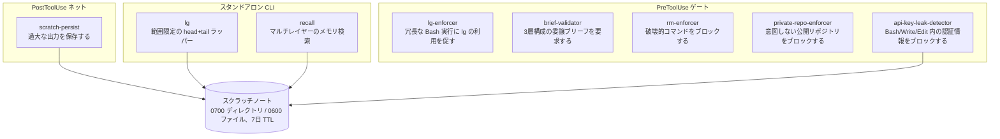

# context-kit — エンジニアリングガイド

[← トップページ](../README.ja.md) ｜ [English](engineering.md) ｜ **日本語**

このページは技術的なエントリーポイントです。このキットが何で構成されているか、なぜこの形になっているか、エンジニアとしてどう組み込むかを説明します。正確なフラグ、変数、契約については [Reference](reference.ja.md) を参照してください。

## 概要

context-kit は、単一の CLI エージェントの作業コンテキストを2つの面から強化します。

- **コンテキストの衛生管理** — 過大なツール出力が会話を埋め尽くさないようにし（`lg`、`scratch-persist`）、過去の作業を再び検索可能にします（`recall`）。
- **事前安全確認（Pre-flight safety）** — 不適切なツール呼び出しを実行前にブロックします。薄い委譲（`brief-validator`）、破壊的コマンド、意図しない公開リポジトリ、認証情報の漏えい（`safety-hooks`）などです。

すべての要素は、Claude Code のフック（ツール呼び出しの前後で起動する小さな Python/Node スクリプト）か、スタンドアロンの CLI のいずれかです。デーモンも共有ライブラリもなく、各要素間で共有される状態もありません。

---

## クイックスタート

```sh
git clone https://github.com/caty-ai/context-kit.git
cd context-kit
sed "s|<CONTEXT_KIT_DIR>|$PWD|g" examples/settings.json
```

出力された `hooks` エントリのうち必要なものを `~/.claude/settings.json` またはプロジェクトの `.claude/settings.json` にマージし、Claude Code を再起動する（または `/hooks` を実行する）、必要に応じて2つの CLI のために `bin/` を `PATH` に追加してください。その後、以下で確認します。

```sh
for t in tests/*.sh; do bash "$t"; done
```

すべてのテストスイートは一時ディレクトリのみを使用し、ケースごとに `PASS`/`FAIL` を1行出力します（6つのスイートで合計88ケース）。

---

## アーキテクチャ

この2経路の設計は制約に基づいています。Claude Code の `PostToolUse` フックは、すでに会話履歴に入ってしまったツールの応答を置き換えることができません。そのため、大きな出力は**事前（proactive）**に処理され（`lg` がコマンド実行前にラップし、範囲を限定したプレビューを返します）、それでもすり抜けてしまった過大な出力には**事後（reactive）**のセーフティネットが働きます（`scratch-persist` がその出力をスクラッチノートにコピーし、後で読み返せるようにします）。



| 要素 | エントリーポイント | トリガー | ランタイム | ドキュメント |
| --- | --- | --- | --- | --- |
| lg | `bin/lg` + `hooks/lg-enforcer.py` | CLI + `PreToolUse: Bash` | Python 3.9+ | [lg.md](lg.md) |
| scratch-persist | `hooks/scratch-persist.sh` → `.py` | `PostToolUse`（すべてのツール） | Python 3.9+ | [scratch-persist.md](scratch-persist.md) |
| brief-validator | `hooks/validate-subagent-brief.sh` → `.py` | `PreToolUse: Agent\|Task` | Python 3.9+ | [brief-validator.md](brief-validator.md) |
| safety-hooks | `hooks/rm-enforcer.py`, `hooks/private-repo-enforcer.mjs`, `hooks/api-key-leak-detector.mjs` | `PreToolUse: Bash`（キー用には `Write\|Edit` も追加） | Python 3.9+ / Node 18+ | [safety-hooks.md](safety-hooks.md) |
| recall | `bin/recall` | CLI | Python 3.9+ | [recall.md](recall.md) |

---

## 設計原則

- **あらゆる箇所で fail-open** — 内部エラーの経路（ファイル欠如、インタプリタ欠如、不正な入力、タイムアウト）はすべて `0` で終了し、何も表示しません。終了コード `2` は本物の検知のためだけに予約されています。エージェントを止めてしまいかねない安全層は、安全層がないよりも悪いものです。
- **ガード付きの配線形式** — すべてのフックは `sh -c 'f="<CONTEXT_KIT_DIR>/hooks/…"; if [ -f "$f" ]; then …; fi'` という形で配線されているため、置換されていないトークンやチェックアウトの移動があっても、すべてのツール呼び出しをブロックするのではなく no-op に縮退します。
- **`CK_` 環境変数プレフィックス** — キットの設定変数とバイパス変数はすべて1つの名前空間を共有します（[全一覧](reference.ja.md)）。バイパスは明示的かつ可視的です。Bash では同一行のトークン、それ以外ではプロセス環境変数を使用します。
- **単一のスクラッチ契約** — 何かを永続化するすべての要素は、同じスクラッチディレクトリのレイアウト、同じパーミッション、同じ7日 TTL のフロントマターで書き込みます。クリーンアップは意図的にユーザー自身が担うものとされています（ドキュメント化された `find` ワンライナーが1つあります）。
- **パターンベースで、範囲を正直に示す** — これらのガードは正規表現レベルの保護であり、シェルパーサーではありません。既知の抜け穴は取り繕うことなく [safety-hooks.md](safety-hooks.md) に列挙されています。
- **ユーザー向けメッセージは英語のみ** — エージェントやユーザーが目にする是正メッセージはすべて英語であり、これによりキットはどのロケールでも同じように動作します。

---

## family-memory-architecture との関係

`recall` はメモリの**個別**側を担います。つまり、1つのエージェントが自分自身のレイヤー（オプトインのホスト型サービス、ローカルインデックス、プレーンなファイル）を検索します。共有・マルチエージェント向けのメモリ設計は [caty-ai/family-memory-architecture](https://github.com/caty-ai/family-memory-architecture) にあり、context-kit はこれをインストールも要求もしません。ローカルのみのセットアップでも完全に機能します。

---

## テスト

```sh
bash tests/test_lg.sh
bash tests/test_lg_enforcer.sh
bash tests/test_scratch_persist.sh
bash tests/test_brief_validator.sh
bash tests/test_safety_hooks.sh
bash tests/test_recall.sh
```

規約：一時ディレクトリのみを使用し、ケースごとに `PASS`/`FAIL` を1行出力し、スイートが実際のユーザーデータに触れないよう root-skip ガードを備えています。各要素のドキュメントの末尾には、実際にインストールした環境を検証するために貼り付けられる、正確な配線を確認するためのプローブがあります。

---

## 制限事項

- enforcer と guard のフックは、証明ではなく後押しとトリップワイヤーです。パターンのリストは意図的に不完全であり、完全なシェルパースは試みていません。既知の抜け穴については [safety-hooks.md](safety-hooks.md) を参照してください。
- `scratch-persist` は、すでに会話に入ってしまったものを縮小することはできません。その価値は、完全な出力がディスク上に残ることにあります。
- スクラッチノートには、シークレットや顧客データが含まれる場合があります。キットが強化するのはデフォルトのスクラッチルートのみであり、ユーザーが指定した `CK_SCRATCH_DIR` は元のパーミッションのままです。
