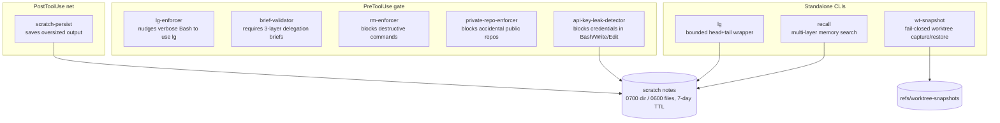

# context-kit — Engineering guide

[← Front page](../README.md) ｜ **English** ｜ [日本語](engineering.ja.md)

This page is the technical entry point: what the kit is made of, why it is shaped this way, and how to wire it as an engineer. Exact flags, variables, and contracts live in the [Reference](reference.md).

## Overview

context-kit hardens a single CLI agent's working context on three fronts:

- **Context hygiene** — keep oversized tool output from flooding the conversation (`lg`, `scratch-persist`) and make past work findable again (`recall`).
- **Pre-flight safety** — block bad tool calls before they run: thin delegations (`brief-validator`), destructive commands, accidental public repos, and credential leaks (`safety-hooks`).
- **Deletion recovery** — capture all deletable parent-worktree state before a human removes a Git worktree (`wt-snapshot`).

Everything is either a Claude Code hook (small Python/Node scripts triggered around tool calls) or a standalone CLI. There is no daemon, no shared library, and no state shared between pieces.

---

## Quick start

```sh
git clone https://github.com/caty-ai/context-kit.git
cd context-kit
sed "s|<CONTEXT_KIT_DIR>|$PWD|g" examples/settings.json
```

Merge the printed `hooks` entries you want into `~/.claude/settings.json` or a project's `.claude/settings.json`, restart Claude Code (or run `/hooks`), and optionally put `bin/` on your `PATH` for the three CLIs. Then verify:

```sh
for t in tests/*.sh; do bash "$t"; done
```

All suites are temp-directory-only and print one `PASS`/`FAIL` line per case (108 cases across 7 suites).

---

## Architecture

The two-path design is constraint-driven: a Claude Code `PostToolUse` hook cannot replace a tool response that already entered conversation history. So large output is handled **proactively** (`lg` wraps the command before it runs and returns a bounded preview) with a **reactive** safety net (`scratch-persist` copies whatever oversized output still got through to a scratch note for later re-reading).



| Piece | Entry point | Trigger | Runtime | Doc |
| --- | --- | --- | --- | --- |
| lg | `bin/lg` + `hooks/lg-enforcer.py` | CLI + `PreToolUse: Bash` | Bash + Python 3.9+ (enforcer) | [lg.md](lg.md) |
| scratch-persist | `hooks/scratch-persist.sh` → `.py` | `PostToolUse` (all tools) | Python 3.9+ | [scratch-persist.md](scratch-persist.md) |
| brief-validator | `hooks/validate-subagent-brief.sh` → `.py` | `PreToolUse: Agent\|Task` | Python 3.9+ | [brief-validator.md](brief-validator.md) |
| safety-hooks | `hooks/rm-enforcer.py`, `hooks/private-repo-enforcer.mjs`, `hooks/api-key-leak-detector.mjs` | `PreToolUse: Bash` (+ `Write\|Edit` for keys) | Python 3.9+ / Node 18+ | [safety-hooks.md](safety-hooks.md) |
| recall | `bin/recall` | CLI | Python 3.9+ | [recall.md](recall.md) |
| wt-snapshot | `bin/wt-snapshot` | CLI before worktree deletion | Bash + Git + tar | [wt-snapshot.md](wt-snapshot.md) |

---

## Design principles

- **Hooks fail open; deletion capture fails closed** — hook internal errors stay silent and allow the tool call, with exit `2` reserved for a genuine hook detection. `wt-snapshot` instead returns nonzero when it cannot prove that deletable state was captured, including dirty submodules.
- **Guarded wiring form** — every hook is wired as `sh -c 'f="<CONTEXT_KIT_DIR>/hooks/…"; if [ -f "$f" ]; then …; fi'`, so an unreplaced token or a moved checkout degrades to a no-op instead of blocking every tool call.
- **`CK_` environment prefix** — all kit configuration and bypass variables share one namespace ([full table](reference.md)). Bypasses are explicit and visible: same-line tokens for Bash, process environment for everything else.
- **One scratch contract** — every piece that persists anything writes into the same scratch directory layout with the same permissions and the same 7-day-TTL frontmatter. Cleanup is deliberately user-owned (one documented `find` one-liner).
- **Pattern-based, honestly scoped** — the guards are regex-level safeguards, not shell parsers. Known gaps are listed in [safety-hooks.md](safety-hooks.md) rather than papered over.
- **English-only prose** — every corrective message is written in English, so the kit reads the same in any locale. One deliberate exception: the brief validator's default section tokens are the Japanese headings of the upstream [family-dev-handbook](https://github.com/caty-ai/family-dev-handbook) contract, overridable via `CK_BRIEF_REQUIRED_SECTIONS`.

---

## Relation to family-memory-architecture

`recall` is the **individual** side of memory: one agent searching its own layers (an opt-in hosted service, a local index, plain files). The shared, multi-agent memory design lives in [caty-ai/family-memory-architecture](https://github.com/caty-ai/family-memory-architecture); context-kit neither installs nor requires it. A local-only setup is fully functional.

---

## Testing

```sh
bash tests/test_lg.sh
bash tests/test_lg_enforcer.sh
bash tests/test_scratch_persist.sh
bash tests/test_brief_validator.sh
bash tests/test_safety_hooks.sh
bash tests/test_recall.sh
bash tests/test_wt_snapshot.sh
```

Conventions: temp directories only, one `PASS`/`FAIL` line per case, and a root-skip guard so suites never touch real user data. Each per-piece doc ends with exact-wiring probes you can paste to verify a live installation.

---

## Limits

- The enforcer and guard hooks are nudges and tripwires, not proof: pattern lists are intentionally incomplete, and no full shell parsing is attempted. See [safety-hooks.md](safety-hooks.md) for the inherited known gaps.
- `scratch-persist` cannot shrink what already entered the conversation; its value is that the full output survives on disk.
- Scratch notes can contain secrets or customer data. The kit hardens only the default scratch root; a user-supplied `CK_SCRATCH_DIR` keeps its own permissions.
